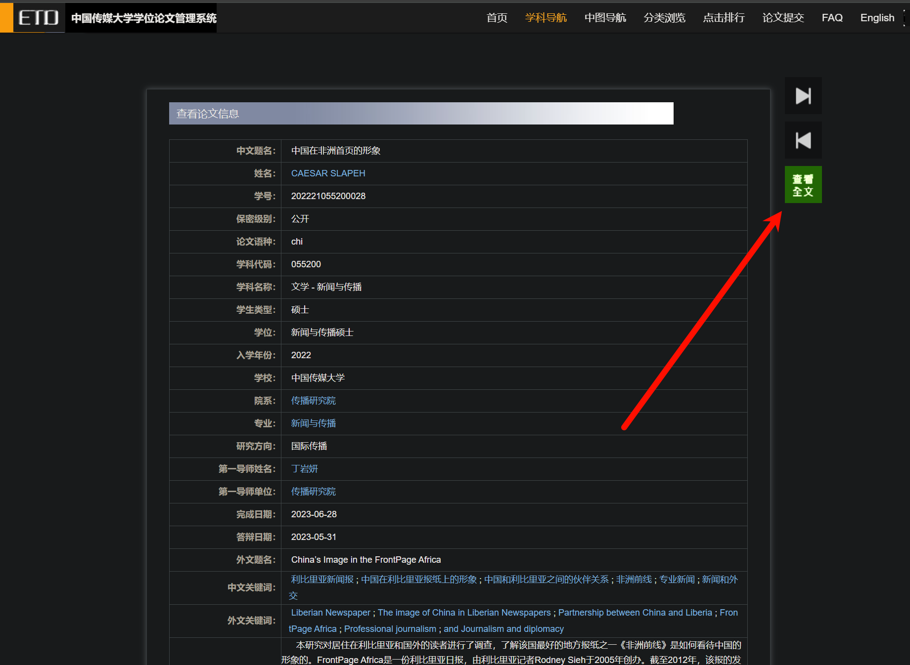
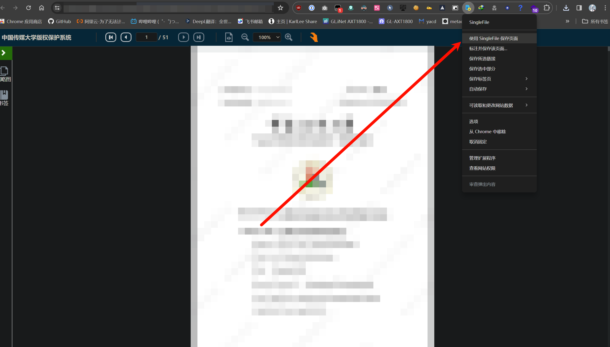
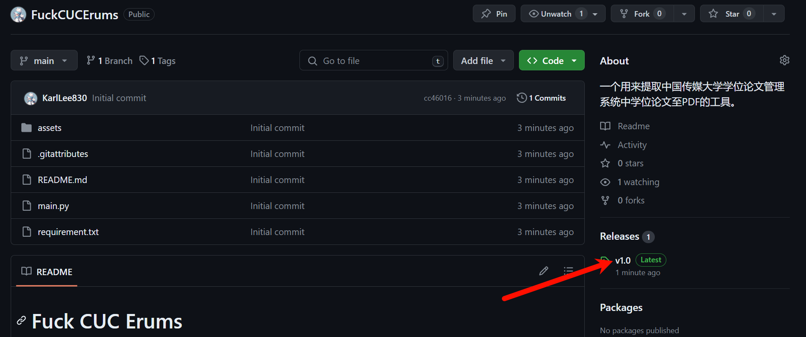
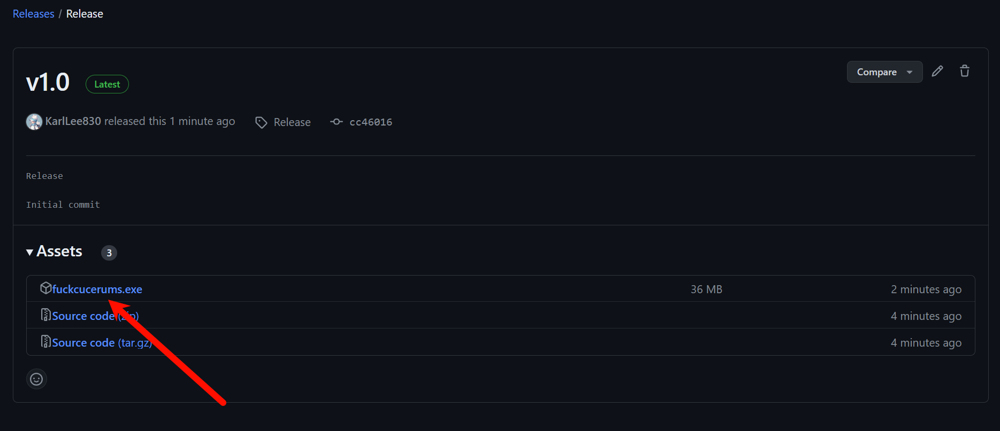
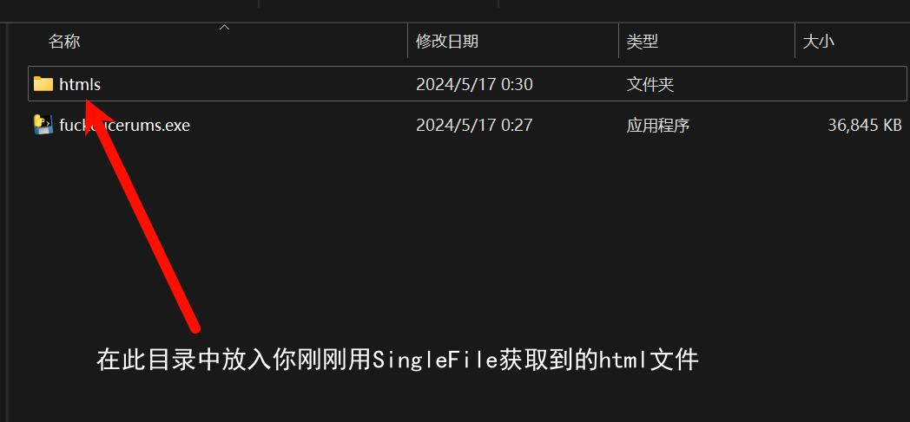
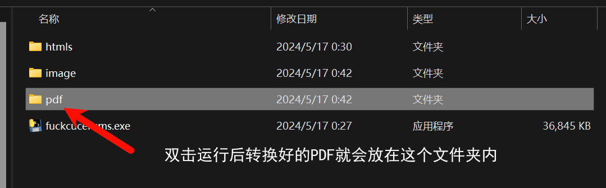

# Fuck CUC Erums

一个用来提取中国传媒大学学位论文管理系统中学位论文至PDF的工具。

## 如何使用？

打开[中国传媒大学学位论文管理系统](https://erums.cuc.edu.cn/)后，选择一篇或几篇你需要下载的论文。

打开论文详情页，点击右侧“查看全文”

等待网页加载完毕，手动滚动网页，使得在线阅读器中的所有图片加载完毕。

使用SingleFile插件抓取整个网页内容，你会获得一份html文件。

**注意：一定要等待网页中论文的所有内容图片加载完全，否则转换后的pdf文件可能缺页漏页！建议多次上下滑动确认全部页加载完全！**

SingleFile浏览器插件下载地址：[Chrome](https://chromewebstore.google.com/detail/singlefile/mpiodijhokgodhhofbcjdecpffjipkle)、[Firefox](https://addons.mozilla.org/firefox/addon/single-file)、[Edge](https://microsoftedge.microsoft.com/addons/detail/efnbkdcfmcmnhlkaijjjmhjjgladedno)

按照下图顺序下载本项目Release中的fuckcucerums.exe。

在fuckcucerums.exe同目录下创建一个htmls文件夹，将你下载需要转换的论文的html文件放进去。然后双击运行.exe即可。

运行后在pdf文件夹内就有全部转换好的pdf文件。

